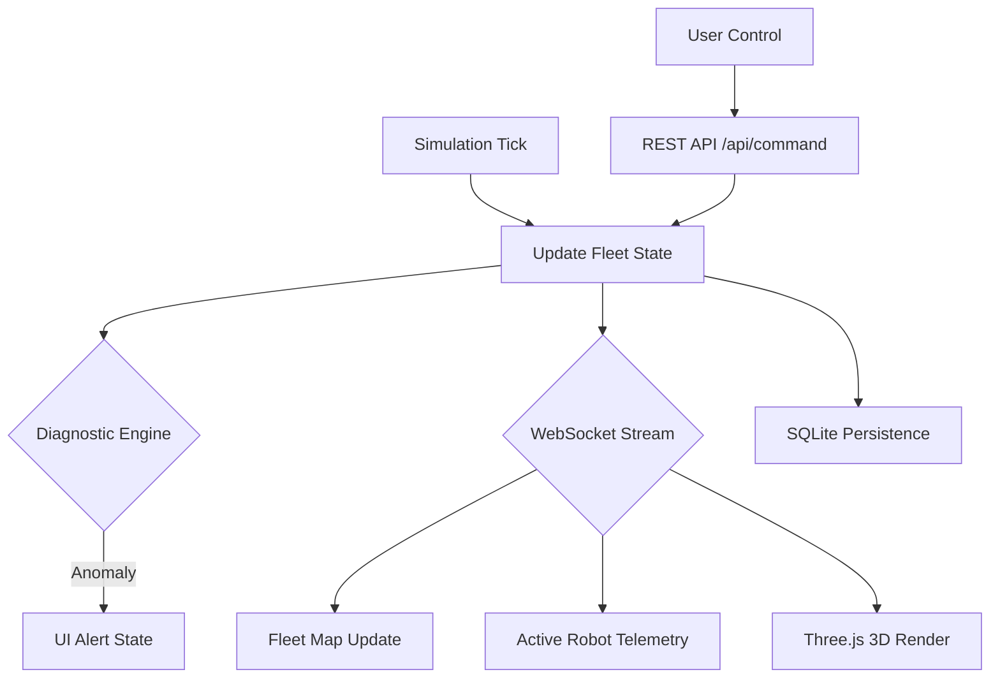

# System Architecture: SKYGUARD AMR-OS

## Core Philosophy
SKYGUARD AMR-OS is built on the **Digital Twin** paradigm. Every component in the system is designed to provide a high-fidelity representation of a physical AMR, allowing for remote monitoring, predictive maintenance, and precise control.

## System Components

### 1. Fleet Dynamics Engine (`src/main.py`)
The system has been scaled to manage a heterogeneous fleet of robots.
- **Fleet Synchronization**: Concurrent tracking of multiple `DijitalIkiz` instances.
- **Kinematics Simulation**: Smooth transition between grid coordinates with individual robot state preservation.
- **Path Prediction**: Simulation of A* breadcrumbs for navigation visualization.
- **Power Management**: Discharge curves based on activity (IDLE vs. NAVIGATING).
- **Fail-Safe Logic**: Per-robot and global emergency state management.

### 2. Mission Persistence Layer (SQLite)
The system automatically logs telemetry snapshots to `missions.db`.
- **Periodic Sampling**: Telemetry frames are preserved using a probabilistic sampling method to ensure balanced storage and coverage.
- **Schema Recovery**: Historical data is fetched via the `/api/history` REST endpoint for UI analysis.

### 3. Diagnostic Engine
Integrated directly into the `update()` cycle:
- **Anomaly Detection**: Monitors $dI/dt$ and $dV/dt$ to detect power system spikes and unexpected battery drops.
- **Reactive UI**: Triggers "Anomaly Mode" (pulsative visual feedback) on the dashboard when critical thresholds are crossed.

### 4. Real-time Telemetry (WebSocket)
Data is streamed from the simulation engine to the dashboard every 1000ms (configurable).
- **Schema**:
  ```json
  {
    "zaman": "HH:MM:SS",
    "robot": {
      "id": "SKYGUARD-01",
      "battery": 98.2,
      "pos": {"x": 2.4, "y": 5.1},
      "status": "NAVIGATING"
    }
  }
  ```

### 3. Command API (REST)
Control commands are sent via HTTP POST requests to `/api/command`. This ensures that every command is acknowledged before execution.
- **Endpoints**:
  - `GOTO`: Coordinates navigation to predefined stations.
  - `EMERGENCY_STOP`: Immediate hardware-level (simulated) halt.
  - `RESET`: Restores system state after an E-Stop.

### 5. Multi-Mode Visualization (Frontend)
- **Glassmorphism UI**: Uses background-blur and semi-transparent layers for a modern aesthetic.
- **HTML5 Canvas**: Frame-synced renderer for the fleet and industrial field.
- **Three.js Digital Twin**: A perspective-correct 3D mode for spatial orientation and depth analysis.
- **Chart.js**: Temporal data visualization for battery health across the active robot.

## Data Flow Diagram


## Future Roadmap
- [ ] SQLite integration for long-term telemetry logging.
- [ ] PID controller simulation for smoother navigation.
- [ ] Multi-AMR coordination support.
