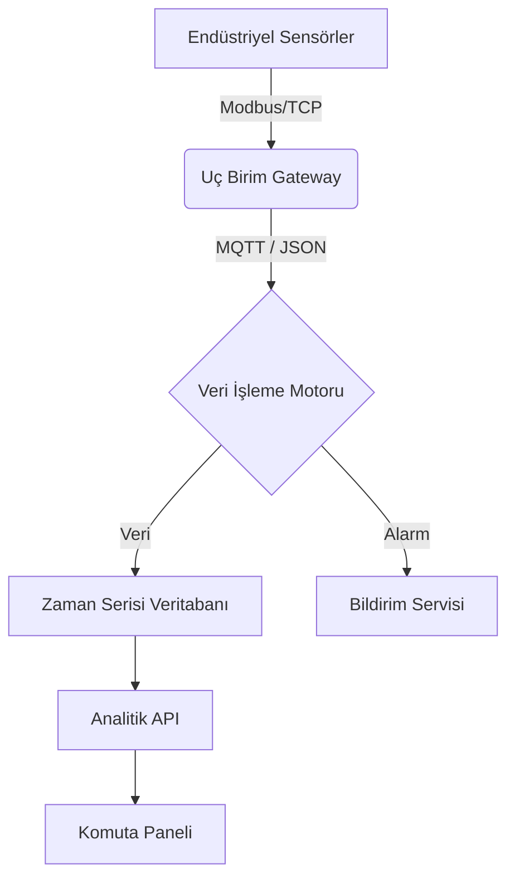

# 🏗 Sistem Mimarisi ve Teknik Detaylar

> **Proje:** Teknofest Sanayide Dijital Teknolojiler  
> **Sürüm:** 1.0.0  
> **Mimari:** Olay Güdümlü Mikroservis (Event-Driven Microservices)

---

## 1. Genel Bakış

Bu proje, Heterojen Endüstriyel IoT (IIoT) ortamlarında veri toplama, işleme ve görselleştirme süreçlerini optimize etmek için tasarlanmıştır. Sistem, sensör verilerini gerçek zamanlı olarak işlemek için **Asenkron G/Ç** modelini kullanır.

## 2. Sistem Bileşenleri

### 2.1. Uç Birimler (Edge Nodes)
Fabrika sahasındaki sensörler ve PLC'ler ile doğrudan iletişim kurar.
- **Protokoller:** MQTT, Modbus TCP, OPC UA.
- **Görevi:** Ham veriyi toplamak, gürültüyü filtrelemek ve Ağ Geçidine iletmek.
- **Teknoloji:** Python (Asyncio), C++.

### 2.2. Veri Toplayıcı ve İşleyicisi (Aggregator)
Farklı kaynaklardan gelen verileri normalize eder ve zaman serisi formatına dönüştürür.
- **Görevi:** Veri zenginleştirme, anomali tespiti (eşik değeri kontrolü).
- **Algoritma:** Kayan Pencere (Sliding Window) analizi.

### 2.3. Komuta Kontrol Paneli (Dashboard)
Operatörler için gerçek zamanlı görselleştirme sunar.
- **Teknoloji:** React.js / Vue.js (Frontend), WebSocket (Canlı Veri).
- **Görselleştirme:** Isı haritaları, gösterge panelleri, 3D dijital ikiz.

## 3. Veri Akış Şeması

## 4. Güvenlik Katmanı

- **Şifreleme:** Tüm veri akışı TLS 1.3 ile şifrelenir.
- **Kimlik Doğrulama:** Cihazlar için X.509 sertifikaları kullanılır.
- **Erişim Kontrolü:** Role-Based Access Control (RBAC).

## 5. Gelecek Planları (Roadmap)
- [ ] Yapay Sinir Ağları ile kestirimci bakım modelinin eğitimi.
- [ ] 5G Private Network entegrasyonu.
- [ ] AR (Artırılmış Gerçeklik) gözlükleri ile bakım desteği.
